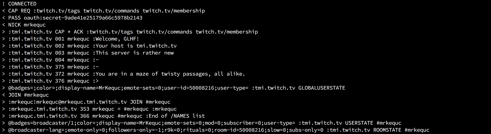

# kequtwitch

This is a node library for interfacing with twitch. It contains Helix, Kraken, and IRC support. Only what you need and nothing else.



---
## Installation
```
npm i --save kequtwitch
```

---
## Usage
```javascript
const Twitch = require('kequtwitch');
```

Create a new instance of Twitch passing an [OAuth token](http://twitchapps.com/tmi/) as the first parameter.
```javascript
const twitch = new Twitch('your-oauth-token');
```

Enjoy a promise-based interface.
```javascript
async function init () {
    await twitch.irc.connect();
    await twitch.irc.join('#mrkequc');
}
```

Connect to channels automatically.
```javascript
const twitch = new Twitch('your-oauth-token', {
    irc: {
        channels: ['#mrkequc']
    }
});

async function init () {
    await twitch.irc.connect();
    // Now in #mrkequc
}
```

Leverage events.
```javascript
twitch.irc.on('ready', () => {
    // Success!
});

twitch.irc.connect();
```

Make API calls.
```javascript
async function requestEmotesets (emotesets) {
    return await twitch.api.request('/chat/emoticon_images', {
        data: { emotesets },
        kraken: true
    });
}
```

---
## Options

| parameter | description |
| - | - |
| `irc.channels` | Array of channels you want joined. (Default: `[]`) |
| `irc.port` | IRC port. (Default: `6667`) |
| `irc.host` | IRC host. (Default: `'irc.chat.twitch.tv'`) |
| `irc.timeout` | Timeout for connection, join, etc. (Default: `7000`) |
| `api.helixUrl` | URL for the Helix API. (Default: `'https://api.twitch.tv/helix'`) |
| `api.krakenUrl` | URL for the Kraken API. (Default: `'https://api.twitch.tv/kraken'`) |
| `api.webhooksPath` | Path for Helix webhooks. (Default: `'/webhooks/hub'`) |
| `logger` | Custom logger with the methods `log`, `info`, `warn`, and `error`. |

---
## How it works

Twitch uses IRC to enable interaction with chat as well as offering several HTTP endpoints.

When you use this library to connect to IRC or access any of those endpoints the token you provide is validated on Twitch's servers. Validation is repeated once an hour when needed automatically as per the [Twitch documentation](https://dev.twitch.tv/docs/authentication/#validating-requests), you don't have to do anything it's handled for you.

This validation step gives us a few parameters which become available on our `twitch` instance making it easy to interact with services.

```javascript
twitch.token; // Token provided in constructor
twitch.validatedAt; // Time the token was validated
twitch.clientId; // Your client id
twitch.login; // Your username
twitch.userId; // Your user id
```

If you want to you can trigger validatation manually.
```javascript
async function validate () {
    await twitch.validate();
    // User information has been populated
}

async function isValidated () {
    await twitch.isValidated();
    // User information has been populated within the last hour
}
```

---
## IRC

While connected to IRC, every line is parsed into an object and then emitted via node `EventEmitter` on the `irc` instance. Event names are the Twitch command in lowercase prepended with `twitch-` if found, otherwise `twitch-unknown`. In addition all messages emit the `message` event.

There are also connection status events.
```javascript
twitch.irc.on('message', (msg) => {
    console.log(msg.raw);
});
```

| event | description |
| - | - |
| `disconnected` | IRC has disconnected. |
| `connecting` | IRC is connecting. |
| `connected` | IRC is connected. |
| `authenticated` | IRC has successfully authenticated. |
| `ready` | The above and IRC has re-joined channels. |
| `message` | Message. |
| `twitch-<command>` | Message. |
| `error` | An error has occurred. |

Examples of listening to and making use of IRC events can be found on the [IRC examples page](docs/irc-examples.md).

---
## API

#### request()

The `request` method takes a `path` as a first parameter, an `options` object, and returns a promise.
```javascript
async function requestUser (id) {
    return await twitch.api.request('/users', {
        data: { id }
    });
}
```

| param | description |
| - | - |
| `skipValidation` | Skip waiting for validation. (Default: `false`) |
| `url` | Url of the API. (Default: ``https://api.twitch.tv/helix`` or ``https://api.twitch.tv/kraken``) |
| `kraken` | Request is made to the 'Kraken' API instead of 'Helix'. (Default: `false`) |
| `method` | Request method. (Default: `'GET'`) |
| `data` | Object containing post data or search parameters. (Default: `{}`) |
| `headers` | Object containing additional headers. (Default: `{}`) |
| `maxRetries` | Number of times to retry failed requests. (Default: `2`) |

#### webhook ()

The `webhook` method is used to subscribe and unsubscribe to [Twitch webhooks](https://dev.twitch.tv/docs/api/webhooks-reference/). This causes post updates to be sent to your application. It takes three parameters, the `path` of the topic, a `callback` url where notifications should be sent, and `options` object.
```javascript
async function requestWebhookFollows (leaseSeconds = 36000) {
    const callback = 'https://mywebsite.com/webhooks/follows';
    const options = {
        data: {
            first: 1,
            to_id: '$userId'
        },
        leaseSeconds
    };
    return await twitch.api.webhook('/users/follows', callback, options);
}
```

| param | description |
| - | - |
| `mode` | Must be either `'subscribe'` or `'unsubscribe'`. (Default: `'subscribe'`) |
| `data` | Object containing post data. (Default: `{}`) |
| `leaseSeconds` | Amount of time you wish to receive updates. (Default: `0`) |
